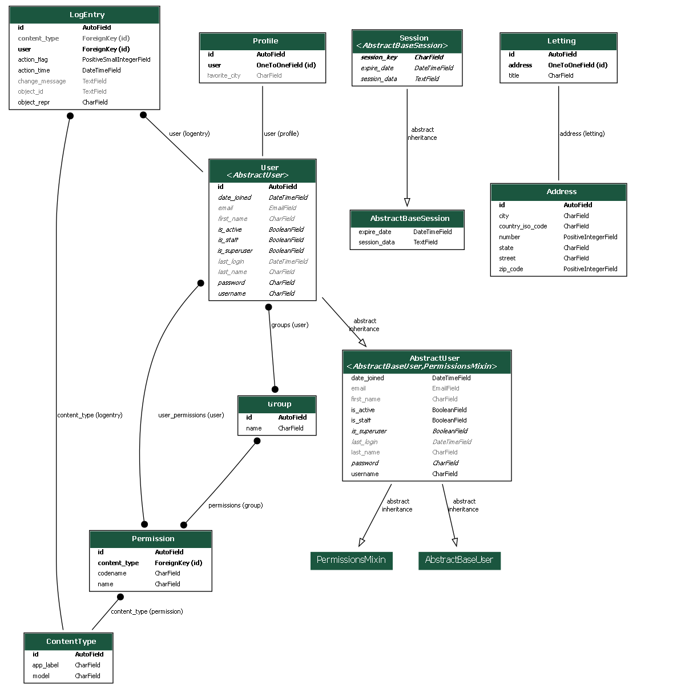

Structure de la Base de Données et Modèles de Données
=====================================================

Cette page fournit une description détaillée de la structure de la base de données et des modèles de données utilisés dans le projet Django. La structure est directement extraite à partir des modèles définis dans le projet.

Modèles Lettings
--------------

.. automodule:: lettings.models
    :members:
    :undoc-members:
    :show-inheritance:

Modèles Profiles
--------------

.. automodule:: profiles.models
    :members:
    :undoc-members:
    :show-inheritance:

Diagramme des Modèles
---------------------

Voici un diagramme de la structure de la base de données, représentant les relations entre les modèles Django et ceux de l'application.

